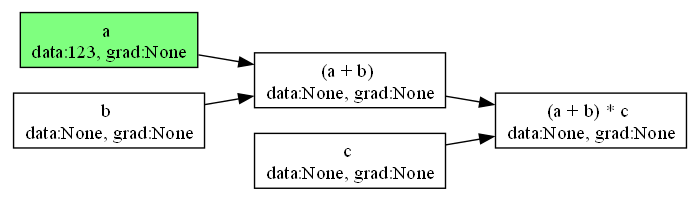
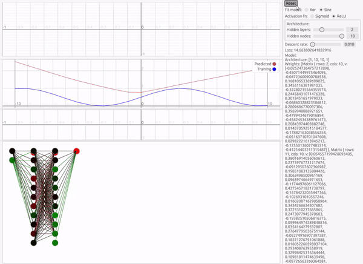

## Recent projects

See [here](https://msakuta.github.io/showcase.html) for more full showcase.

### rustograd
<a href="https://github.com/msakuta/rustograd">

An experimental implementation of autograd in Rust

</a>

### DeepRender
<a href="https://github.com/msakuta/DeepRender">
    
An experimental Neural Network trainer/visualizer in Rust

    

</a>

### Swarm-rs
<a href="https://github.com/msakuta/swarm-rs">
    
swarm-js ported to Rust eframe application

    

</a>

### cfd-wasm
<a href="https://github.com/msakuta/cfd-wasm">
    
Computational Fluid Dynamics in Wasm with Rust

    

</a>

### WebGL-Orbiter
<a href="https://github.com/msakuta/WebGL-Orbiter">
    
Rocket orbital simulator on the web

    

</a>
